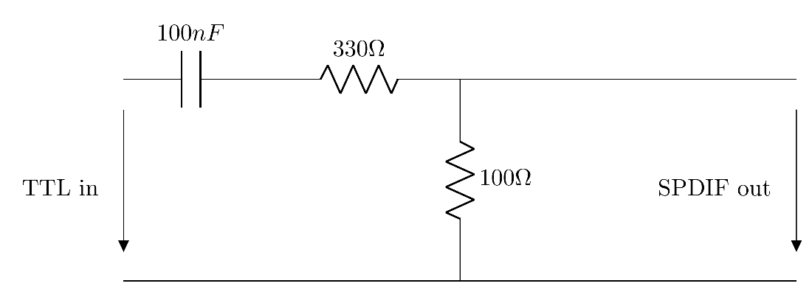

# Autogenerator for Faust on Teensy

## Prerequisites

* [PlatfromIO](https://platformio.org/): This project is build around PlatfromIO and its toolchain
* [Python](https://www.python.org/): The project use python to enable pre-scripts and code Generation
* [Python cogapp](https://pypi.org/project/cogapp/): code generation inside the source file

## Basic Usage

1. Clone the repo
2. Put your Faust program as ```FaustInstrument.dsp``` in the root directory.
3. (optional) configure your environment in ```platformio.ini```
4. Run PlatformIO on CLI, ```-e``` specifies your custom environment, ```-t upload``` executes the flashing step after compiling
``` bash
pio run -e teensy41 -t upload
```

## Features supported via Faust Metadata

### Menu IO

Add Units to values. Example:
``` faust
a  = hslider("attack[unit:s]", 0.01, 0, 5, 0.01);
```

Set a fine-tune value. Example:
``` faust
freq_offset1  = hslider("foff1[fine:0.01][unit:semitones]", 0, -12, 12, 1);
```

Group elements to put them in a submenu. Example:
``` faust
AmpEnv(x) = vgroup("AmpEnv", x);

a = AmpEnv(hslider("attack[unit:s]", 0.01, 0, 5, 0.01));
d = AmpEnv(hslider("decay[unit:s]", 0.01, 0, 5, 0.01));
s = AmpEnv(hslider("sustain[unit:%]", 0.98, 0.001, 1, 0.01));
r = AmpEnv(hslider("release[unit:s]", 0.01, 0, 5, 0.01));
```

Generate a menu to select values for a slider/entry/etc. Example:
``` faust
osc_sel1 = hslider("osz1[style:menu{'Sine':0;'Triangle':1;'Saw':2;'Square':3;'Noise':4}]", 0, 0, 4, 1);
```

### Sensor data

Access analog data. It will automatically scaled to be in your selected range. Example (reads from analog input 10):
``` faust
light = nentry("lightSens[io: A10]", 0, -1, 1, 0.1);
```

If you connect an [MPU 6050](https://www.amazon.de/AZDelivery-GY-521-MPU-6050-Parent/dp/B07ZCTHY7T) to the second I2C port of a Teensy (Pins 17/16 on Teensy 4.0/4.1) it is possible to use the gyroscope or accelerometer. The parameter is the Axis. It is scaled to fit the given range. Example:
``` faust
gyro = nentry("gyroSens[gyr: 1]", 0, -1, 1, 0.1) : si.smoo;
acc = nentry("acceSens[acc: 1]", 0, -1, 1, 0.1) : si.smoo;
```

## Platform configuration

It is possible to configure different options of the hardware platform in the ```platformio.ini``` file. They are available as preprocessor defines. Example environment configuration:
``` ini
[env:teensy41]
platform = teensy
board = teensy41
framework = arduino
build_flags = -D USECLICKENCODER -D USELCD -D USB_MIDI_SERIAL -D USESPDIF -D USBHOSTMIDI
lib_deps = 
	neu-rah/ArduinoMenu library@^4.21.3
	soligen2010/ClickEncoder@0.0.0-alpha+sha.9337a0c46c
extra_scripts = 
	pre:pre_script.py
```

The ```build_flags``` contain these parameters. The ```-D``` sets a parameter as defined. ```USB_MIDI_SERIAL``` is a parameter of the Teensy platform. You can find more information [here](https://docs.platformio.org/en/latest/platforms/teensy.html). The other parameters are described in the next section.

### Available Parameters

Some parameter configurations might be incompatible with each other. You have to make sure to select the ones that make sense.

#### Menu IO

* ```USECLICKENCODER``` - use an encoder on input 3, 2 and button on input 5
* ```USELCD``` - use an [HD44780 style LCD](https://en.wikipedia.org/wiki/Hitachi_HD44780_LCD_controller)
* ```USEU8G2``` - use an [OLED Display](https://github.com/olikraus/u8g2)
* ```USEBUTTON``` - use buttons on inputs 2, 3, 4 and 5
* ```INVERTFIELDKEYS``` - invert direction for field keys, might be necessary for some inputs

#### MIDI

* ```USBHOSTMIDI``` - use a MIDI device connected to the [Teensy's Host USB Port](https://www.pjrc.com/store/cable_usb_host_t36.html)
* ```USBCLIENTMIDI``` - use MIDI Input on USB MIDI Device (Teensy needs to be in USB MIDI Mode)
* ```HARDWAREMIDI``` - use a [Hardware MIDI](https://www.pjrc.com/teensy/td_libs_MIDI.html) interface on Serial 4

#### Audio

* ```SGTL5000``` - use the SGTL5000 on [a Teensy audio board](https://www.pjrc.com/store/teensy3_audio.html)
* ```USESPDIF``` - use SPDIF Output on Pin 7


Example Circuit for converting the SPDIF Signal

#### Debug

* ```DEBUGOUT``` - print debug statements on USB Serial device (Teensy has be configured to work as a USB Serial Device), waits with program execution until the serial is opened on the Computer

# File Structure

* ```platformio.ini``` - configure environments
* ```FaustInstrument.dsp``` - Faust program
* ```pre_script.py``` - python script to convert Faust code
* ```src/main.cpp``` - C++ skeleton
* ```src/main.py``` - python cogapp code
